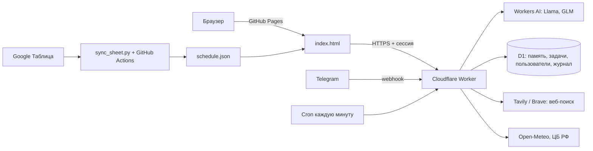

# YASIK — веб-приложение с ИИ-агентом и Telegram-ботом

Личный дашборд для студента: расписание, погода, задачи с напоминаниями и чат с ИИ-агентом, который сам выбирает инструменты (поиск в интернете, калькулятор, курсы валют, задачи, долговременная память). Те же возможности доступны в Telegram-боте.

**Демо:** https://yasikkkk.github.io


## Возможности

- **ИИ-агент с инструментами.** Модель сама решает, какой инструмент вызвать, и повторяет вызовы, пока не соберёт ответ (до 3 шагов, до 3 вызовов за шаг).
- **Долговременная память.** Агент сохраняет устойчивые факты о пользователе (до 50 фактов), а экран «Моя память» позволяет их просматривать и удалять.
- **Задачи и напоминания.** Агент добавляет, показывает, отмечает и удаляет задачи, даты разбирает из обычной речи («завтра в 9:00»).
- **Telegram-бот.** Чат с агентом, напоминания, утренние и вечерние сводки, кнопки «Готово» и «Отложить».
- **Расписание.** Скрипт на Python превращает Google Таблицу в JSON, GitHub Actions обновляет сайт автоматически.
- **Дополнительно.** Создание картинок, вопросы по картинкам, чтение прикреплённых файлов, большие документы по разделам, русский и английский интерфейс.

## Архитектура



| Часть | Технологии |
|---|---|
| Фронтенд | HTML, CSS, JavaScript, GitHub Pages |
| Бэкенд | Cloudflare Workers (один воркер: API, вебхук Telegram, cron) |
| Модели | Workers AI: Llama 3.1 8B, Llama 3.3 70B, GLM-4.7-flash; зрение и генерация картинок |
| Хранилище | Cloudflare D1 (SQLite) |
| Данные расписания | Python (только стандартная библиотека), GitHub Actions |

## Инструменты агента

| Инструмент | Что делает |
|---|---|
| `web_search` | Поиск в интернете (Tavily или Brave), источники ранжируются по надёжности |
| `read_page` | Читает текст страницы по ссылке, закрыт доступ к внутренним адресам |
| `calculator` | Точные вычисления; разбор выражений рекурсивным спуском, без `eval` |
| `get_schedule` | Пары на 14 дней, дата, время и погода |
| `exchange_rate` | Официальные курсы ЦБ РФ |
| `add_task`, `list_tasks`, `complete_task`, `delete_task` | Задачи и напоминания в D1 |
| `remember`, `forget` | Долговременная память; не сохраняет пароли и длинные числа |

Новый инструмент добавляется записью в `AGENT_TOOLS` и веткой в `runTool`.

## Безопасность

- Вход через Google (проверка токена и `aud`) или по почте и паролю; пароли хранятся как хэш PBKDF2-SHA256 с индивидуальной солью.
- Подписанные сессии (HMAC-SHA256) на 30 дней.
- Автоматическая проверка браузера (proof-of-work) вместо капчи, одноразовые задачи.
- Ограничения на число попыток входа и проверок с одного адреса; в базе хранится только отпечаток, не IP.
- Вебхук Telegram проверяет секретный заголовок.
- Все ключи лежат в секретах Cloudflare, в репозитории их нет.

## Наблюдаемость и тесты

Каждый вызов инструмента пишется в таблицу `agent_log` (хранится 30 дней). Защищённая точка `/admin` показывает журнал и статистику, а также запускает **набор из 22 автотестов поведения агента**: когда он обязан вызвать инструмент, когда обязан ответить сразу, правильно ли считает даты, не выдумывает ли ссылки и не сохраняет ли пароли в память.

## Структура репозитория

```
index.html        # интерфейс сайта
worker/index.js   # Cloudflare Worker: агент, API, Telegram
sync_sheet.py     # Google Таблица → schedule.json
weekly.json       # еженедельные правила расписания
schedule.json     # результат синхронизации
.github/workflows # автообновление расписания
```

## Запуск своей копии

1. Создайте воркер в Cloudflare и вставьте `worker/index.js`.
2. Привязки (Bindings): **Workers AI** с именем `AI` и **D1** с именем `DB`.
3. Переменные: `ALLOWED_ORIGIN` (адрес сайта без слэша в конце), `GOOGLE_CLIENT_ID`.
4. Секреты: `TURNSTILE_SECRET` (любая длинная случайная строка, подпись сессий), `TAVILY_API_KEY`, `TG_BOT_TOKEN`, `TG_WEBHOOK_SECRET`, `ADMIN_KEY`.
5. Cron-триггер: `* * * * *`.
6. Вебхук Telegram:
   `https://api.telegram.org/bot<ТОКЕН>/setWebhook?url=<АДРЕС_ВОРКЕРА>/telegram&secret_token=<TG_WEBHOOK_SECRET>`
7. В `index.html` найдите адрес воркера и замените его на свой.

Бесплатный тариф Workers AI ограничен 10 000 нейронов в день: агентные запросы и картинки расходуют лимит быстрее обычного чата.

## Автор

[yasikkkk](https://github.com/yasikkkk). Проект сделан с помощью Claude.
